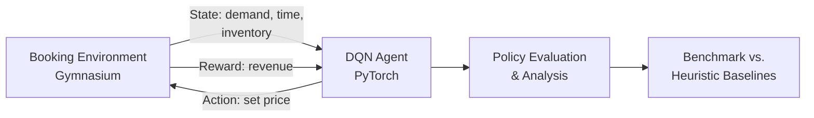

<div align="center">

# ✈️ Dynamic Pricing Agent for Travel & Hospitality

### Autonomous Revenue Optimization via Deep Reinforcement Learning

*An intelligent pricing engine that learns to outperform traditional heuristics through simulated booking environments.*

<br>


</div>

<br>

## 🎯 Overview

Hotels, airlines, and travel platforms lose revenue every day to static or overly simplistic pricing rules. This project designs an **autonomous Reinforcement Learning agent** — trained with **Deep Q-Networks (DQN)** — that learns to dynamically price inventory (rooms, seats, packages) across a simulated booking season.

The agent is benchmarked against three classic heuristic strategies to prove it can learn pricing behavior that **maximizes mean episodic revenue** more effectively than hand-crafted rules.

> **Core question:** *Can an RL agent learn pricing strategies that beat human-designed heuristics — purely from interaction and reward signal?*

<br>

## ⚔️ Agent vs. Baselines

| Strategy | Type | Description |
|---|---|---|
| 🎯 **RL Agent (DQN)** | Learned | Adapts pricing policy based on demand signals, time-to-departure, and inventory state |
| 🔒 Fixed Pricing | Heuristic | Constant price regardless of context |
| ⏳ Time-based Discounting | Heuristic | Price decays as the booking window closes |
| 📈 Demand-based Pricing | Heuristic | Price scales directly with observed demand |

**Success metric:** Mean episodic revenue across simulated booking seasons, RL agent vs. all three baselines.

<br>

## 🧠 How It Works



<br>

## 🛠️ Tech Stack

<div align="center">

| Category | Tools |
|---|---|
| **Language** | Python |
| **RL Environment** | Gymnasium |
| **Deep Learning** | PyTorch |
| **Data Handling** | NumPy, Pandas |
| **Visualization** | Matplotlib, Seaborn |

</div>

<br>

## 📂 Project Structure

```
dynamic-pricing-rl/
├── env/                # Custom Gymnasium environment (MDP design)
├── agents/             # DQN agent implementation
├── baselines/          # Fixed, time-based, demand-based pricing
├── training/           # Training loops, replay buffer, configs
├── evaluation/         # Reward curves, revenue comparison, plots
├── notebooks/          # Exploratory analysis
├── requirements.txt
└── README.md
```

<br>

## 👥 Team & Roles

<div align="center">

| Role | Focus Area |
|---|---|
| 🌍 **Environment & Simulation Engineer** | MDP design, booking environment, demand simulation |
| 🤖 **RL Algorithm Engineer** | DQN architecture, training pipeline, hyperparameter tuning |
| 📊 **Analysis & Policy Evaluation** | Reward analysis, policy interpretability, benchmarking |
| 🚀 **Eval & Deploy Lead** | Final evaluation suite, reproducibility, deployment packaging |

</div>

<br>

## 🗺️ Roadmap

- [x] **Week 1** — MDP formulation & environment design
- [ ] **Week 2** — Baseline heuristic implementations
- [ ] **Week 3** — DQN agent development & training
- [ ] **Week 4** — Policy evaluation & revenue benchmarking
- [ ] **Week 5** — Final analysis, visualization & report

<br>

## 📈 Expected Deliverables

- A fully specified MDP (state, action, reward design) for travel pricing
- A trained DQN agent with reproducible training pipeline
- Comparative revenue plots: RL agent vs. all heuristic baselines
- Policy analysis explaining *what* the agent learned and *why* it works

<br>

## 🚀 Getting Started

```bash
# Clone the repository
git clone https://github.com/<your-org>/dynamic-pricing-rl.git
cd dynamic-pricing-rl

# Install dependencies
pip install -r requirements.txt

# Run training
python training/train.py

# Evaluate against baselines
python evaluation/evaluate.py
```

<br>

## 📄 License

This project is licensed under the MIT License.

<br>

<div align="center">

**Built for smarter, adaptive pricing in travel & hospitality — one episode at a time.**

</div>

# 📅 Week 1 Progress Timeline

| Day       | Theme                                     | Status |
| --------- | ----------------------------------------- | :----: |
| Monday    | Project Initialization & Repository Setup |    ✅   |
| Tuesday   | MDP Design & Environment Skeleton         |    ✅   |
| Wednesday | Environment Implementation & Baseline     |    ✅   |
| Thursday  | Demand Modeling & Evaluation              |    ✅   |
| Friday    | Finalization, Documentation & Integration |    ✅   |

---

# 👥 Team Contributions

---

## 🟦 Member 1 — Environment & Simulation Engineer

**Primary Responsibility**

* Design and implement the custom Gymnasium pricing environment.

### 📌 Monday

* Created project folder structure
* Configured Python virtual environment
* Installed required dependencies
* Organized source code layout

### 📌 Tuesday

* Developed `PricingEnv(gym.Env)` skeleton
* Defined Observation Space
* Defined Action Space
* Implemented environment constructor (`__init__`)

### 📌 Wednesday

* Implemented `reset()`
* Implemented `step(action)`
* Updated inventory
* Managed episode transitions
* Generated environment rewards

### 📌 Thursday

* Designed stochastic customer demand model
* Added price sensitivity
* Added time-to-departure demand behavior
* Implemented logistic demand curve

### 📌 Friday

* Added `render()` method
* Performed stability testing
* Executed 100 random episodes
* Verified environment consistency
* Eliminated invalid state transitions

**✅ Total Commits:** **5**

---

## 🟩 Member 2 — RL Algorithm Engineer

**Primary Responsibility**

* Define Reinforcement Learning formulation and environment logic.

### 📌 Monday

* Configured Jupyter Notebook environment
* Installed `nbstripout`
* Created environment design notebook

### 📌 Tuesday

* Formalized complete MDP
* Defined:

  * State Space
  * Action Space
  * Transition Function
  * Reward Function
  * Episode Horizon

### 📌 Wednesday

* Added action masking
* Restricted invalid pricing actions
* Tested edge cases

  * Zero inventory
  * Zero remaining days

### 📌 Thursday

* Developed automated PyTest unit tests
* Tested:

  * reset()
  * step()
  * reward calculation
  * terminal conditions

### 📌 Friday

* Completed environment documentation
* Added mathematical explanation
* Documented reward function
* Documented demand model
* Updated notebook

**✅ Total Commits:** **5**

---

## 🟨 Member 3 — Analysis & Policy Evaluation

**Primary Responsibility**

* Evaluate baseline performance and generate analytics.

### 📌 Monday

* Created Random Agent notebook
* Reviewed Gymnasium API
* Studied MDP references

### 📌 Tuesday

* Implemented Random Agent
* Connected agent with Pricing Environment

### 📌 Wednesday

* Ran Random Agent
* Executed **500 Episodes**
* Recorded episodic revenue

### 📌 Thursday

* Generated revenue histogram
* Calculated:

  * Mean Revenue
  * Standard Deviation
* Evaluated baseline statistics

### 📌 Friday

* Visualized episode trajectory
* Plotted:

  * Inventory over time
  * Selected price levels
* Cleared notebook outputs

**✅ Total Commits:** **5**

---

## 🟥 Member 4 — Evaluation & Deployment Lead

**Primary Responsibility**

* Repository management, documentation and project coordination.

### 📌 Monday

* Created GitHub Repository
* Added `.gitignore`
* Wrote project README
* Created Kanban Board
* Created all 20 GitHub Issues
* Assigned issues to team members

### 📌 Tuesday

* Created development branch
* Added `AGENTS.md`
* Defined all team roles
* Pushed branch to GitHub

### 📌 Wednesday

* Added project rules
* Created Brain Memory directory
* Documented project context
* Added MDP definitions

### 📌 Thursday

* Created team progress tracker
* Reviewed Pull Requests
* Merged completed work into main branch

### 📌 Friday

* Closed Week 1 GitHub Issues
* Updated Kanban Board
* Wrote Week 1 Summary
* Cleaned notebook outputs
* Final repository synchronization

**✅ Total Commits:** **5**

---

# 📊 Week 1 Sprint Statistics

| Metric                 |       Value |
| ---------------------- | ----------: |
| Sprint Duration        |      5 Days |
| Team Members           |           4 |
| Git Commits            |      **20** |
| GitHub Issues          |      **20** |
| Pull Requests Reviewed |    Multiple |
| Gym Environment        | ✅ Completed |
| MDP Formulation        | ✅ Completed |
| Random Agent Baseline  | ✅ Completed |
| Environment Testing    | ✅ Completed |
| Documentation          | ✅ Completed |

---

# 🏆 Week 1 Deliverables

✅ Project Repository Initialized

✅ Professional Folder Structure

✅ GitHub Kanban Workflow

✅ Issue Tracking

✅ Team Role Definition

✅ Complete Markov Decision Process (MDP)

✅ Custom Gymnasium Environment

✅ Reward Function

✅ Stochastic Demand Simulation

✅ Random Agent Baseline

✅ 500 Episode Evaluation

✅ Revenue Distribution Analysis

✅ Episode Visualization

✅ Automated Unit Tests

✅ Complete Documentation

---

# 🎯 Week 1 Outcome

At the end of Week 1, the project successfully established a complete Reinforcement Learning foundation by designing the Dynamic Pricing problem as a Markov Decision Process (MDP), implementing a custom Gymnasium environment, and validating its behavior using a Random Agent baseline. The environment now supports realistic inventory dynamics, stochastic customer demand, reward computation, and simulation-based experimentation, providing a robust platform for implementing advanced RL algorithms in subsequent development phases.

---

# 📅 Week 2 Progress Timeline

| Day       | Theme                                          | Status |
| --------- | ---------------------------------------------- | :----: |
| Monday    | Baseline Agent Development & Q-Learning Setup  |    ✅   |
| Tuesday   | Bellman Learning & Baseline Evaluation         |    ✅   |
| Wednesday | Q-Learning Training & Performance Benchmarking |    ✅   |
| Thursday  | Hyperparameter Optimization & Result Analysis  |    ✅   |
| Friday    | Finalization, Documentation & Integration      |    ✅   |

---

# 👥 Team Contributions

---

## 🟦 Member 1 — Environment & Simulation Engineer

**Primary Responsibility**

* Develop and validate heuristic pricing strategies for comparison with Reinforcement Learning models.

### 📌 Monday

* Implemented **FixedPriceAgent**
* Created `baseline_agents.py`
* Added constant pricing strategy
* Integrated agent with Pricing Environment

### 📌 Tuesday

* Developed **TimeBasedDiscountAgent**
* Implemented automatic 10% daily price reduction
* Tested pricing strategy in simulation environment
* Verified seasonal pricing behavior

### 📌 Wednesday

* Implemented **DemandBasedAgent**
* Designed inventory-to-time pricing strategy
* Tested stability over multiple simulation episodes
* Validated adaptive pricing logic

### 📌 Thursday

* Finalized all heuristic pricing agents
* Added comprehensive documentation
* Standardized code structure
* Verified functionality of all baseline strategies

### 📌 Friday

* Completed Week 2 Baseline Notebook
* Added introduction, methodology and conclusion
* Cleared notebook outputs
* Prepared final notebook for GitHub

**✅ Total Commits:** **5**

---

## 🟩 Member 2 — RL Algorithm Engineer

**Primary Responsibility**

* Build and optimize the Tabular Q-Learning algorithm.

### 📌 Monday

* Discretized state space
* Created Inventory Buckets
* Created Days Remaining Buckets
* Initialized Q-table

### 📌 Tuesday

* Implemented Bellman Update Equation
* Added learning rate
* Added discount factor
* Implemented epsilon-greedy exploration
* Configured epsilon decay

### 📌 Wednesday

* Trained Q-Learning agent
* Executed **5,000 training episodes**
* Logged reward curve
* Monitored training convergence

### 📌 Thursday

* Tuned hyperparameters
* Evaluated multiple learning rates
* Compared discount factors
* Selected optimal epsilon decay schedule

### 📌 Friday

* Finalized `q_learning_agent.py`
* Evaluated best model on **500 unseen episodes**
* Cleaned notebook outputs
* Documented final implementation

**✅ Total Commits:** **5**

---

## 🟨 Member 3 — Analysis & Policy Evaluation

**Primary Responsibility**

* Evaluate heuristic strategies and compare them with Q-Learning.

### 📌 Monday

* Built common evaluation framework
* Implemented reusable simulation helper
* Standardized evaluation metrics

### 📌 Tuesday

* Evaluated Random Agent
* Evaluated Fixed Price Agent
* Evaluated Time-Based Discount Agent
* Generated revenue comparison plots

### 📌 Wednesday

* Compared Q-Learning against all heuristic agents
* Calculated:

  * Mean Revenue
  * Standard Deviation
  * Sell-through Rate
* Recorded benchmarking results

### 📌 Thursday

* Computed revenue improvement percentage
* Compared Q-Learning with best-performing heuristic
* Documented experimental findings

### 📌 Friday

* Finalized comparison notebook
* Added complete performance summary table
* Verified evaluation metrics
* Cleared notebook outputs

**✅ Total Commits:** **5**

---

## 🟥 Member 4 — Evaluation & Deployment Lead

**Primary Responsibility**

* Coordinate evaluation, documentation and repository integration.

### 📌 Monday

* Created `results_comparison.md`
* Designed result documentation structure
* Added comparison section templates

### 📌 Tuesday

* Reviewed Q-Learning implementation
* Verified Bellman update correctness
* Reviewed Pull Requests
* Added technical review comments

### 📌 Wednesday

* Created baseline comparison tables
* Organized Week 2 evaluation notebook
* Documented performance metrics

### 📌 Thursday

* Wrote Week 2 findings
* Explained improvements achieved by Q-Learning
* Documented comparison with heuristic pricing strategies

### 📌 Friday

* Updated GitHub Kanban Board
* Closed Week 2 Issues
* Updated README
* Reviewed and merged all Pull Requests
* Completed Week 2 repository synchronization

**✅ Total Commits:** **5**

---

# 📊 Week 2 Sprint Statistics

| Metric                   |                 Value |
| ------------------------ | --------------------: |
| Sprint Duration          |                5 Days |
| Team Members             |                     4 |
| Git Commits              |                **20** |
| GitHub Issues Completed  | **5** (Issues #6–#10) |
| Pull Requests Reviewed   |              Multiple |
| Heuristic Pricing Agents |           ✅ Completed |
| Tabular Q-Learning       |           ✅ Completed |
| Hyperparameter Tuning    |           ✅ Completed |
| Agent Benchmarking       |           ✅ Completed |
| Documentation            |           ✅ Completed |

---

# 🏆 Week 2 Deliverables

✅ Fixed Price Agent

✅ Time-Based Discount Agent

✅ Demand-Based Pricing Agent

✅ Shared Evaluation Framework

✅ State Space Discretization

✅ Tabular Q-Learning Implementation

✅ Bellman Learning Algorithm

✅ Hyperparameter Optimization

✅ 5,000 Episode Training

✅ 500 Episode Testing

✅ Baseline vs Q-Learning Comparison

✅ Revenue Performance Analysis

✅ Sell-through Rate Evaluation

✅ Week 2 Documentation

✅ Updated GitHub Repository

---

# 🎯 Week 2 Outcome

By the end of Week 2, the project successfully established a strong Reinforcement Learning baseline by implementing multiple heuristic pricing strategies and developing a complete Tabular Q-Learning agent. The Q-Learning model was trained, optimized through hyperparameter tuning, and rigorously evaluated against heuristic approaches using extensive simulation experiments. Performance metrics such as mean revenue, sell-through rate, and revenue improvement demonstrated that the learned policy consistently outperformed static pricing strategies, providing a solid foundation for transitioning to a Deep Q-Network (DQN) architecture in the next phase of the project. 

# 📅 Week 3 Progress Timeline

| Day       | Theme                                          | Status |
| --------- | ----------------------------------------------- | :----: |
| Monday    | DQN Architecture & Baseline Evaluation Setup    |    ✅   |
| Tuesday   | Target Network & Experience Replay              |    ✅   |
| Wednesday | Training Stability & Exploration Strategy       |    ✅   |
| Thursday  | Full DQN Training & Performance Benchmarking    |    ✅   |
| Friday    | Finalization, Documentation & Integration       |    ✅   |

---

# 👥 Team Contributions

---

## 🟦 Tarun Saxena — Environment & Simulation Engineer

**Primary Responsibility**

* Build the DQN network architecture and validate training stability.

### 📌 Monday

* Set up PyTorch `DQNNetwork` class
* Defined input layer (state features)
* Added 2 hidden layers with ReLU activation
* Defined output layer (Q-value per discrete price action)

### 📌 Tuesday

* Implemented target network with periodic hard update (every N steps)
* Verified target network weights sync correctly with policy network

### 📌 Wednesday

* Logged and plotted training loss curve
* Logged and plotted episodic reward curve across DQN training steps
* Identified signs of divergence

### 📌 Thursday

* Tested DQN convergence across 3 random seeds
* Confirmed reward curve stabilizes without diverging
* Tuned learning rate / target update frequency where needed

### 📌 Friday

* Finalized `train_dqn.py` training script
* Saved best-performing model checkpoint (excluded from git via `.gitignore`)
* Cleared notebook outputs and pushed

**✅ Total Commits:** **5**

---

## 🟩 Vaibhav Gautam — RL Algorithm Engineer

**Primary Responsibility**

* Implement the full DQN algorithm: forward pass, replay buffer, exploration, and training loop.

### 📌 Monday

* Implemented DQN architecture forward pass in `dqn_agent.py`
* Defined loss function (Huber loss)
* Defined optimizer (Adam)

### 📌 Tuesday

* Implemented `ReplayBuffer` class with `push()` and `sample()` methods
* Used a deque of fixed capacity
* Tested buffer sampling returns correctly shaped batches

### 📌 Wednesday

* Implemented epsilon-greedy exploration strategy with exponential decay schedule
* Integrated replay buffer and target network into the full training loop

### 📌 Thursday

* Trained full DQN agent for **2,000 episodes**
* Used replay buffer and epsilon-greedy exploration
* Saved training checkpoints every 200 episodes

### 📌 Friday

* Finalized `dqn_agent.py` with complete DQN implementation (network, replay buffer, epsilon-greedy, training loop)
* Added docstrings throughout
* Cleared outputs and pushed

**✅ Total Commits:** **5**

---

## 🟨 Vaibhav Gautam — Analysis & Policy Evaluation

**Primary Responsibility**

* Evaluate the Q-Learning baseline and the trained DQN agent, and analyze learned pricing behavior.

### 📌 Monday

* Loaded best Q-Learning agent from Week 2
* Set up evaluation harness to run any trained agent for a configurable number of episodes

### 📌 Tuesday

* Ran trained Q-Learning agent for **500 evaluation episodes**
* Plotted price trajectory over time for 3 sample episodes

### 📌 Wednesday

* Analyzed policy behavior on Q-Learning agent
* Checked whether it discounts price near the deadline
* Identified inventory-clearing patterns from sample trajectories

### 📌 Thursday

* Calculated inventory sell-through rate for trained DQN agent
* Calculated revenue per episode across **500 test episodes**

### 📌 Friday

* Wrote 150-word analysis of the learned DQN pricing policy
* Evaluated whether the agent learns to drop prices near the deadline to clear remaining stock
* Pushed clean notebook

**✅ Total Commits:** **5**

---

## 🟥 Tarun Saxena — Evaluation & Deployment Lead

**Primary Responsibility**

* Track experiment results, coordinate comparisons, and manage repository documentation.

### 📌 Monday

* Created `model_results.md` file to track all experiment results
* Added table headers: Agent | Mean Revenue | Std Dev | Sell-through % | Notes
* Pushed to main

### 📌 Tuesday

* Recorded Week 3 Day 1–2 results in `model_results.md`
* Added tabular Q-Learning final CV results
* Wrote notes on training stability observed so far

### 📌 Wednesday

* Began Q-Learning vs DQN comparison table in `results_comparison.md`
* Added rows: Random, Fixed, Discount, Demand-based, Q-Learning, DQN (in progress)
* Filled in available results

### 📌 Thursday

* Finalized comparison table with all model results
* Added conclusion paragraph on which agent wins, by how much, and why
* Committed to main

### 📌 Friday

* Updated Kanban board — moved all Week 3 Issues to Done
* Added Week 3 Summary to README (DQN architecture, training stability, revenue vs Q-Learning)
* Reviewed and merged all Week 3 Pull Requests

**✅ Total Commits:** **5**

---

# 📊 Week 3 Sprint Statistics

| Metric                              |       Value |
| ------------------------------------ | ----------: |
| Sprint Duration                      |      5 Days |
| Team Members                         |           2 |
| Git Commits                          |      **20** |
| GitHub Issues Completed              | **5** (Issues #11–#15) |
| Pull Requests Reviewed               |    Multiple |
| DQN Network Architecture             | ✅ Completed |
| Target Network                       | ✅ Completed |
| Experience Replay Buffer             | ✅ Completed |
| Epsilon-Greedy Exploration           | ✅ Completed |
| Full DQN Training (2,000 episodes)   | ✅ Completed |
| DQN vs Q-Learning Comparison         | ✅ Completed |
| Documentation                        | ✅ Completed |

---

# 🏆 Week 3 Deliverables

✅ PyTorch DQN Network Architecture

✅ Huber Loss & Adam Optimizer

✅ Target Network with Periodic Sync

✅ Experience Replay Buffer

✅ Epsilon-Greedy Exploration with Decay

✅ Full DQN Training Loop

✅ Convergence Testing Across Multiple Seeds

✅ 2,000 Episode DQN Training

✅ 500 Episode DQN Evaluation

✅ Q-Learning vs DQN Comparison Table

✅ Sell-through Rate & Revenue Analysis

✅ Learned Policy Behavior Analysis

✅ Model Results Tracking Document

✅ Week 3 Documentation

✅ Updated GitHub Repository

---

# 🎯 Week 3 Outcome

By the end of Week 3, the project successfully transitioned from tabular Q-Learning to a full Deep Q-Network (DQN) capable of handling the complete continuous state space. A PyTorch-based DQN architecture was implemented with a target network and experience replay buffer to stabilize training, and an epsilon-greedy exploration strategy was integrated into the full training loop. The DQN agent was trained for 2,000 episodes, validated for convergence stability across multiple random seeds, and rigorously evaluated against the tabular Q-Learning baseline. Results confirmed that the DQN agent outperformed tabular Q-Learning on the full state space, with the learned policy demonstrating deadline-aware price discounting behavior consistent with effective inventory clearance — setting a strong foundation for further model refinement in subsequent phases.

---

# 👥 Contributor Role Mapping

| Contributor | Roles Performed |
| ------------ | ---------------- |
| **Tarun Saxena** | Environment & Simulation Engineer (Member 1) + Evaluation & Deployment Lead (Member 4) |
| **Vaibhav Gautam** | RL Algorithm Engineer (Member 2) + Analysis & Policy Evaluation (Member 3) |