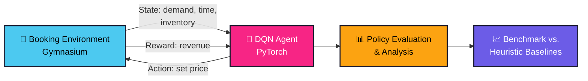

<div align="center">

# ✈️ Dynamic Pricing Agent for Travel & Hospitality

### 🧠 Autonomous Revenue Optimization via Deep Reinforcement Learning

*An intelligent pricing engine that learns to outperform traditional heuristics through simulated booking environments.*

<br>


<br>


</div>

<br>

## 🎯 Overview

Hotels, airlines, and travel platforms lose revenue every day to **static or overly simplistic pricing rules**. This project designs an **autonomous Reinforcement Learning agent** — trained with **Deep Q-Networks (DQN)** — that learns to dynamically price inventory (rooms, seats, packages) across a simulated booking season.

The agent is benchmarked against three classic heuristic strategies to prove it can learn pricing behavior that **maximizes mean episodic revenue** more effectively than hand-crafted rules.

> 💡 **Core question:** *Can an RL agent learn pricing strategies that beat human-designed heuristics — purely from interaction and reward signal?*

<br>

## ⚔️ Agent vs. Baselines

| Strategy | Type | Description |
|:---|:---:|:---|
| 🎯 **RL Agent (DQN)** | `Learned` | Adapts pricing policy based on demand signals, time-to-departure, and inventory state |
| 🔒 Fixed Pricing | `Heuristic` | Constant price regardless of context |
| ⏳ Time-based Discounting | `Heuristic` | Price decays as the booking window closes |
| 📈 Demand-based Pricing | `Heuristic` | Price scales directly with observed demand |

> 📌 **Success metric:** Mean episodic revenue across simulated booking seasons — RL agent vs. all three baselines.

<br>

## 🧠 How It Works


```mermaid
flowchart LR
    A[🏨 Booking Environment<br/>Gymnasium] -->|State: demand, time,<br/>inventory| B[🤖 DQN Agent<br/>PyTorch]
    B -->|Action: set price| A
    A -->|Reward: revenue| B
    B --> C[📊 Policy Evaluation<br/>& Analysis]
    C --> D[📈 Benchmark vs.<br/>Heuristic Baselines]

    style A fill:#4CC9F0,stroke:#1a1a2e,stroke-width:2px,color:#000
    style B fill:#F72585,stroke:#1a1a2e,stroke-width:2px,color:#fff
    style C fill:#FCA311,stroke:#1a1a2e,stroke-width:2px,color:#000
    style D fill:#6C5CE7,stroke:#1a1a2e,stroke-width:2px,color:#fff
```

<br>

## 🛠️ Tech Stack

<div align="center">

| Category | Tools |
|:---|:---|
| 🐍 **Language** | Python |
| 🎮 **RL Environment** | Gymnasium |
| 🔥 **Deep Learning** | PyTorch |
| 🧮 **Data Handling** | NumPy, Pandas |
| 📊 **Visualization** | Matplotlib, Seaborn |
| 🖥️ **Dashboard** | Streamlit |

</div>

<br>

## 📂 Project Structure

```
Travel-Hospitality-Autonomous-Pricing-Agent-via-Reinforcement-Learning/
│
├── 🖥️ app.py                          # Streamlit business dashboard (interactive)
├── 📄 README.md
├── 📄 requirements.txt
├── 🎨 architecture.svg                # System architecture diagram
├── 🎨 banner.svg                      # README banner graphic
│
├── 📊 results_comparison.md           # Baseline vs Q-Learning vs DQN comparison
├── 📊 model_results.md                # Experiment tracking across all agents
├── 📝 progress_tracker.md             # Team commit/progress log
├── 📝 week2_qlearning_review.md       # Q-Learning implementation review notes
├── 👥 AGENTS.md                       # Team role definitions
│
├── ⚙️ .antigravity/
│   └── rules.md                       # Project development rules
├── ⚙️ .gemini/antigravity/brain/
│   ├── project_context.md             # High-level project context
│   └── mdp_definition.md              # MDP formulation reference
│
├── 📓 notebooks/                      # Run in sequence, Week 1 → Final
│   ├── NOTEBOOK_SETUP.md
│   ├── week1_env_design.ipynb             # MDP formulation & environment build
│   ├── week1_random_agent.ipynb           # Random-agent baseline
│   ├── week2_baselines.ipynb              # Heuristic baseline agents
│   ├── week2_qlearning.ipynb              # Tabular Q-Learning
│   ├── week3_dqn.ipynb                    # Deep Q-Network training
│   ├── week4_evaluation.ipynb             # 1,000-episode statistical evaluation
│   └── final_dashboard.ipynb              # Full project summary notebook
│
├── 🧩 src/                            # Core source modules
│   ├── pricing_env.py                     # Custom Gymnasium environment
│   ├── baseline_agents.py                 # FixedPrice / TimeBasedDiscount / DemandBased
│   ├── random_agent.py                    # Random-action baseline
│   ├── q_learning_agent.py                # Tabular Q-Learning agent
│   ├── dqn_network.py                     # PyTorch DQN architecture
│   ├── dqn_agent.py                       # DQN agent (training loop logic)
│   ├── replay_buffer.py                   # Experience replay buffer
│   ├── train_dqn.py                       # DQN training entry point
│   ├── training_monitor.py                # Loss/reward curve monitoring
│   ├── eval_utils.py                      # Shared evaluation helpers
│   ├── plotting_utils.py                  # Shared plotting helpers
│   ├── pricing_utils.py                   # Shared pricing helper functions
│   ├── test_env_stability.py              # Environment stress test
│   ├── test_fixed_agent.py                # FixedPriceAgent unit test
│   ├── test_discount_agent.py             # TimeBasedDiscountAgent unit test
│   └── test_dqn_convergence.py            # DQN convergence test across seeds
│
├── ✅ tests/                          # Formal test suite
│   ├── test_env.py
│   └── test_pricing_utils.py
│
└── 📈 outputs/                        # Generated plots & saved artifacts
    ├── qlearning_training_curve.png
    ├── dqn_convergence_curves.png
    ├── dqn_policy_analysis.png
    ├── dqn_multi_season_trajectories.png
    ├── qlearning_policy_behavior.png
    ├── qlearning_sample_trajectories.png
    ├── baseline_comparison_boxplot.png
    ├── all_agents_violin_comparison.png
    ├── random_agent_revenue_histogram.png
    ├── sample_episode_trajectory.png
    ├── inventory_depletion.png
    ├── trained_qtable.npy
    └── trained_qtable_best.npy
```

<br>

## 👥 Team & Roles

<div align="center">

| Role | Focus Area |
|:---|:---|
| 🌍 **Environment & Simulation Engineer** | MDP design, booking environment, demand simulation |
| 🤖 **RL Algorithm Engineer** | DQN architecture, training pipeline, hyperparameter tuning |
| 📊 **Analysis & Policy Evaluation** | Reward analysis, policy interpretability, benchmarking |
| 🚀 **Eval & Deploy Lead** | Final evaluation suite, reproducibility, deployment packaging |

</div>

<br>

## 🗺️ Roadmap

- [x] **Week 1** — MDP formulation & environment design
- [x] **Week 2** — DQN agent development & training
- [x] **Week 3** — Policy evaluation & revenue benchmarking
- [x] **Week 4** — Final analysis, visualization & report

<br>

## 📈 Expected Deliverables

- ✅ A fully specified MDP (state, action, reward design) for travel pricing
- ✅ A trained DQN agent with reproducible training pipeline
- ✅ Comparative revenue plots: RL agent vs. all heuristic baselines
- ✅ Policy analysis explaining *what* the agent learned and *why* it works

<br>

---

## 🚀 Getting Started

### ✅ Prerequisites
- Python 3.10+
- Git

### ⚙️ Installation

```bash
# 1️⃣ Clone the repository
git clone <repo-url>
cd Travel-Hospitality-Autonomous-Pricing-Agent-via-Reinforcement-Learning

# 2️⃣ Create and activate a virtual environment
python -m venv venv
.\venv\Scripts\Activate.ps1        # Windows PowerShell

# 3️⃣ Install dependencies
pip install -r requirements.txt
```

<br>

## 📓 Running the Project

Notebooks are located in `notebooks/` and are designed to be run **in sequence**:

| Order | Notebook | Description |
|:-----:|----------|--------------|
| 1️⃣ | `week1_env_design.ipynb` | MDP formulation & custom Gym environment |
| 2️⃣ | `week2_baselines.ipynb` | Heuristic baseline pricing agents |
| 3️⃣ | `week2_qlearning.ipynb` | Tabular Q-Learning implementation |
| 4️⃣ | `week3_dqn.ipynb` | Deep Q-Network (DQN) training |
| 5️⃣ | `week4_evaluation.ipynb` | Large-scale evaluation & statistical testing |
| 6️⃣ | `final_dashboard.ipynb` | Complete project summary & results |

**🖥️ Interactive dashboard** (optional):
```bash
streamlit run app.py
```

<br>

---

## 📊 Results

Full agent comparison tables and statistical analysis are available in:
- 📄 [`results_comparison.md`](./results_comparison.md) — baseline vs. Q-Learning vs. DQN comparison
- 📄 [`model_results.md`](./model_results.md) — detailed experiment tracking

> 🏆 Adaptive pricing strategies (time-based, demand-based, and learned policies) consistently outperform static pricing across 1,000 simulated booking seasons, with statistically significant improvements confirmed via paired t-testing.

<br>

---

## 👥 Team

<div align="center">

| # | Member | Role |
|:-:|:---|:---|
| 01 | **Tarun Saxena** | Environment & Simulation Engineer |
| 02 | **Vaibhav Gautam** | RL Algorithm Engineer |
| 03 | **Vaibhav Gautam** | Analysis & Policy Evaluation |
| 04 | **Tarun Saxena** | Eval & Deploy Lead |

</div>

<br>

---

## 📄 License

This project is licensed under the **MIT License**.

<br>

<div align="center">

### 🌟 Built for smarter, adaptive pricing in travel & hospitality — one episode at a time. 🌟


</div>
